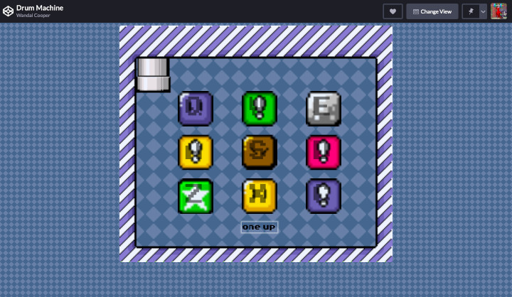

# Drum Machine
A Super Mario World themed drum machine.

## Purpose/Goal
The goal was to make a drum machine that allow the user to click a square or press a corresponding key on the keyboard to play a sound. This project was required for a FCC certification.

## Operation
To play a sound;
* click on a square.
* press a corresponding key on your keboard.

## Tech/Libraries Used
* HTML
* CSS
* JavaScript
* React

## Problems/Solutions
* A difficulty I had was trying to get an audio file to match up with a square and play when a key was pressed or the button was clicked. To solve this I had to learn about how to use references within React.

## More Information
N/A
